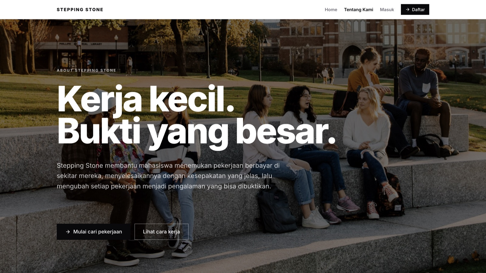
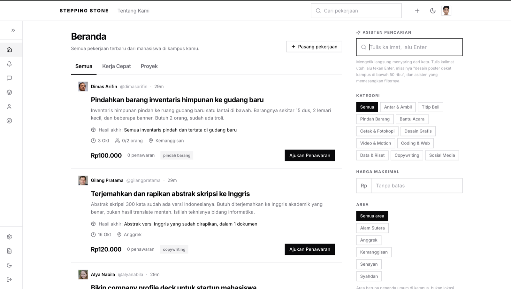
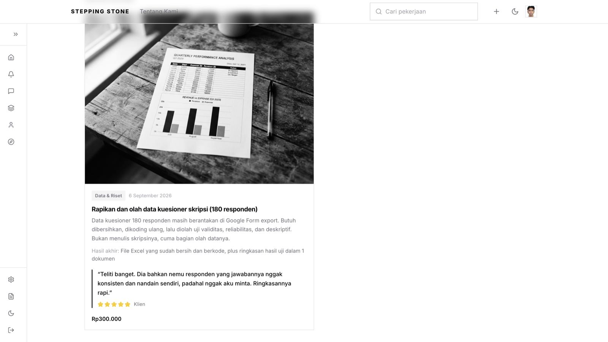
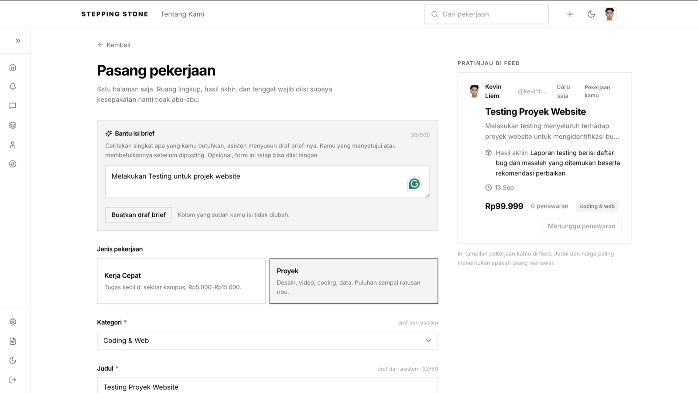
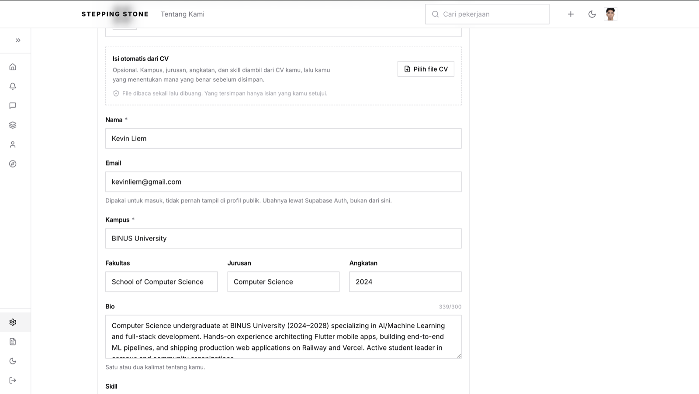
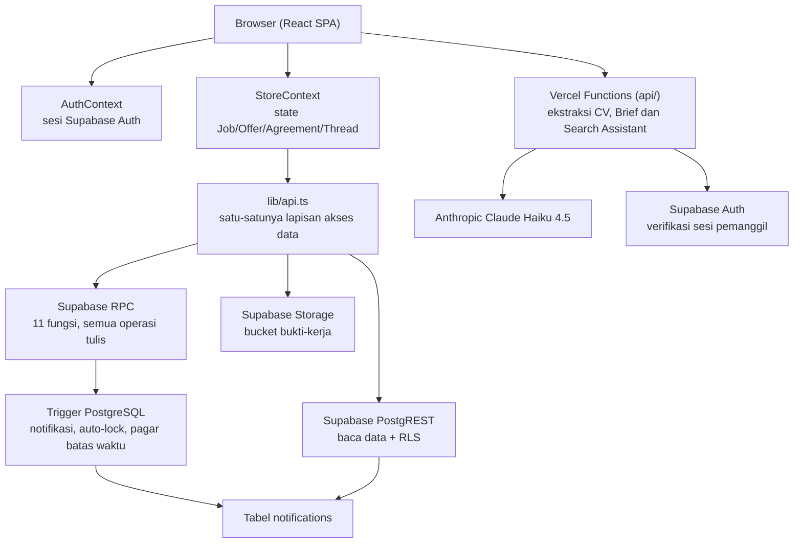
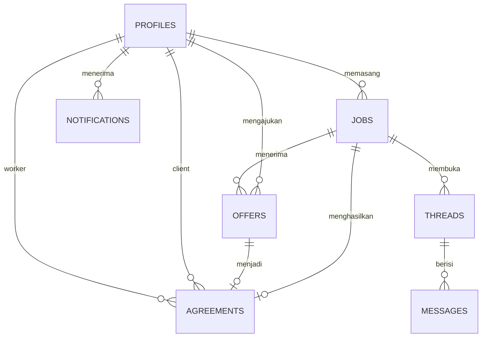
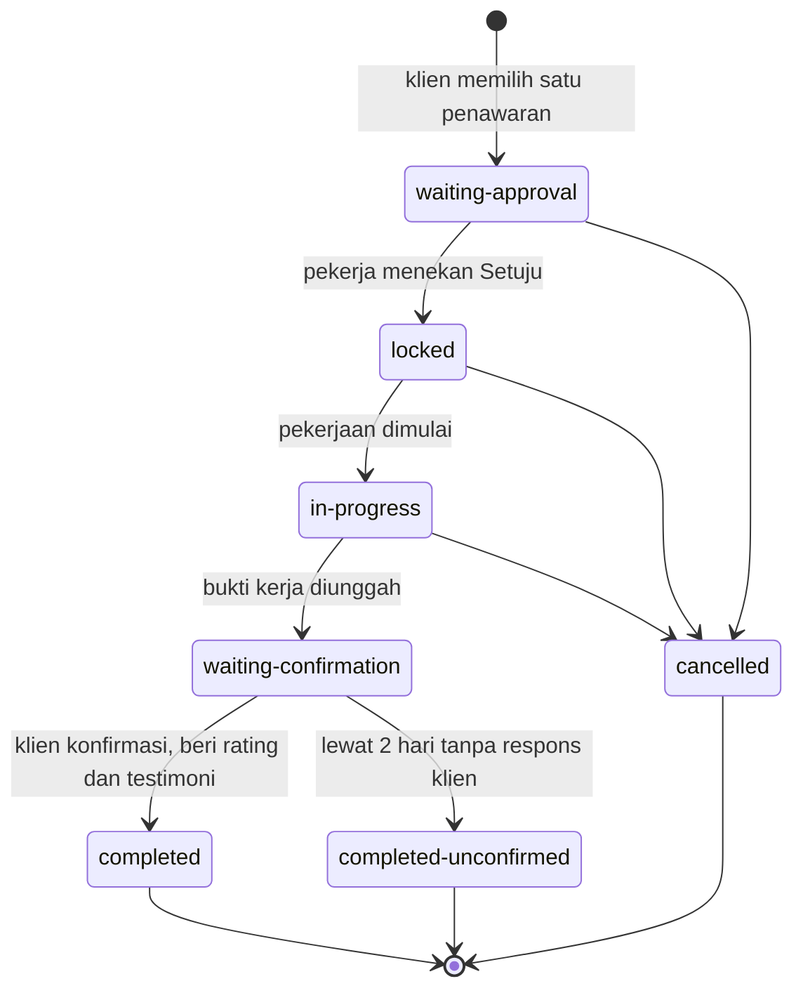
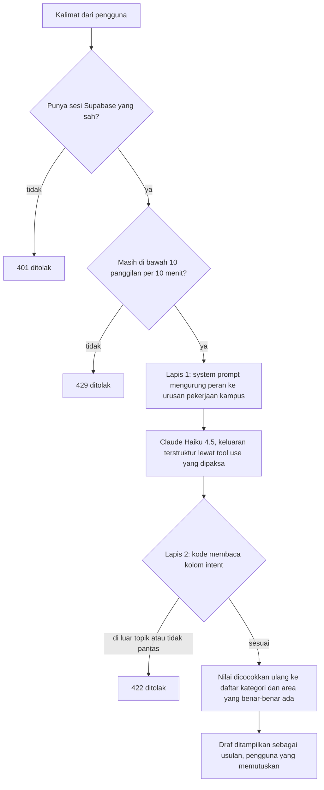
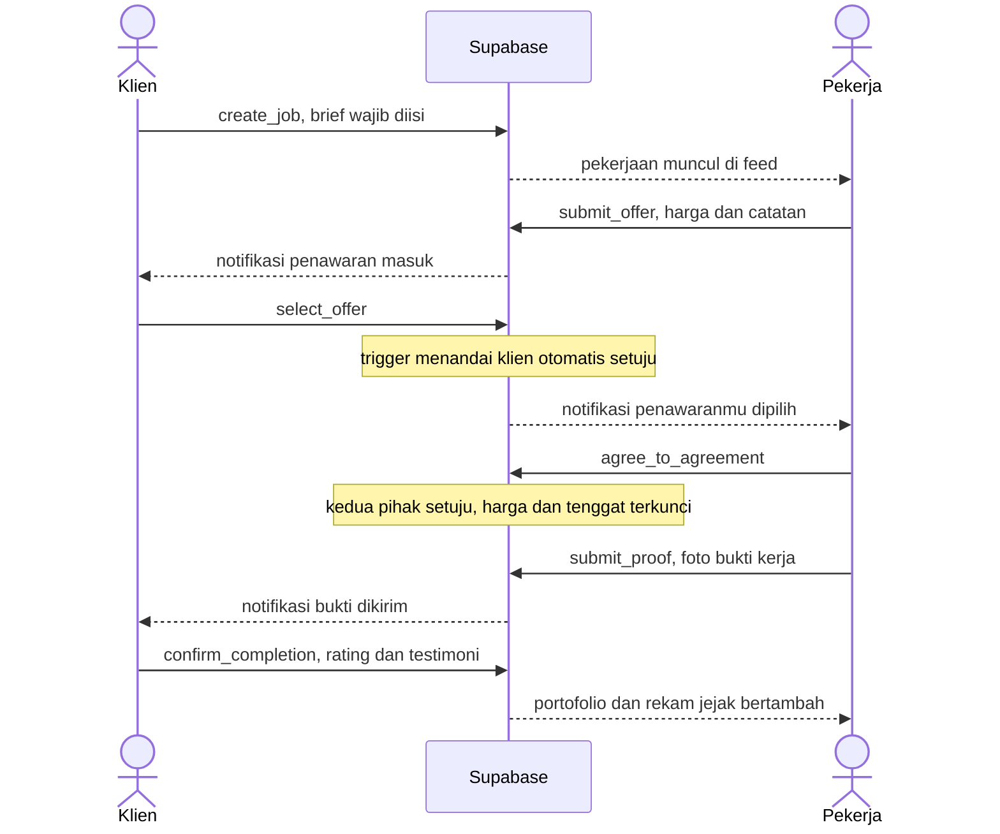

<div align="center">

  # Stepping Stone
  ### Kerja Kampus, Kesepakatan Jelas, Portofolio Nyata

  [](https://stepping-stone-eight.vercel.app)
  [](https://github.com/lewron135/Stepping-Stone)
  [](LICENSE)

  **Submission untuk ITECHNO CUP 2026 - Web Development**

  **By Entar ajadeh**

</div>

---

## Daftar Isi

- [Tentang Proyek](#tentang-proyek)
- [Kesesuaian Tema dan SDG](#kesesuaian-tema-dan-sdg)
- [Fitur Unggulan](#fitur-unggulan)
- [Demo dan Screenshot](#demo-dan-screenshot)
- [Teknologi](#teknologi)
- [Arsitektur Sistem](#arsitektur-sistem)
- [Skema Database](#skema-database)
- [Cara Kerja AI](#cara-kerja-ai)
- [Instalasi dan Setup](#instalasi-dan-setup)
- [Penggunaan](#penggunaan)
- [API Documentation](#api-documentation)
- [Testing](#testing)
- [Keputusan Teknis](#keputusan-teknis)
- [Status Pengembangan](#status-pengembangan)
- [Tim Pengembang](#tim-pengembang)
- [Lisensi](#lisensi)

---

## Tentang Proyek

### Latar Belakang

Di kolom komentar hampir setiap lowongan magang, satu kalimat muncul berulang-ulang:

> *"Cari pengalaman kok syaratnya harus sudah punya pengalaman."*

Itu lingkaran yang menutup sendiri. Untuk diterima kerja kamu butuh bukti pengalaman; untuk
punya bukti pengalaman kamu harus diterima kerja lebih dulu. Mahasiswa yang belum pernah masuk
ke lingkaran itu tidak punya pintu masuk sama sekali.

Padahal pekerjaannya **sudah ada**, tepat di sekitar mereka. Setiap minggu ada yang butuh poster
acara himpunan, butuh dibantu olah data kuesioner, butuh video after movie diedit, butuh dititipi
beli makan siang. Semuanya dikerjakan mahasiswa, untuk mahasiswa, dan dibayar.

Masalahnya semua itu menguap begitu selesai. Kesepakatannya lewat chat pribadi, pembayarannya
lewat transfer, lalu tidak ada satu pun jejak yang bisa ditunjukkan ke pemberi kerja berikutnya.
Kerja informal antar teman kampus juga rawan masalah klasik: harga berubah di tengah jalan,
tenggat molor tanpa kejelasan, dan hasil kerja yang sudah diserahkan tidak dibayar.

Jadi ada dua kerugian sekaligus. Yang bekerja tidak terlindungi, **dan** bahkan ketika semuanya
berjalan lancar, tidak ada apa pun yang tertinggal.

### Solusi yang Ditawarkan

**Stepping Stone memotong lingkaran itu dengan satu prinsip: setiap pekerjaan kecil harus
meninggalkan bukti.**

Alurnya satu garis lurus, dan tidak ada langkah yang bisa dilewati:

```
temukan kerjaan  ->  ajukan penawaran & nego  ->  KESEPAKATAN TERKUNCI
                                                          |
                        portofolio  <-  testimoni  <-  kerjakan & unggah bukti
```

Begitu kedua pihak setuju, harga dan tenggat **dikunci di level database** dan tidak bisa diubah
sepihak oleh siapa pun, termasuk lewat panggilan langsung ke database. Setelah pekerjaan selesai,
bukti kerja dan testimoni klien otomatis jadi entri portofolio di profil publik pekerja.

Sekali transaksi, dua hasil: **uang, dan bukti pengalaman yang bisa ditunjukkan.**

| Masalah | Yang dilakukan Stepping Stone |
|---------|-------------------------------|
| Harga berubah di tengah jalan | Harga dan tenggat terkunci di level tabel begitu kedua pihak setuju |
| Kerja selesai tapi tidak dibayar | Laporan Belum Dibayar, tercatat permanen di rekam jejak klien |
| Klien menghilang saat konfirmasi | Batas 2 hari, pekerjaan tetap masuk rekam jejak pekerja |
| Selesai kerja tanpa jejak apa pun | Bukti dan testimoni otomatis jadi entri portofolio |
| Tidak tahu harus ambil kerjaan apa | Career Compass menyarankan proyek sedikit di atas level sekarang |

### Tujuan Proyek

- **Tujuan utama**: Memberi mahasiswa pintu masuk pertama ke pengalaman kerja yang bisa dibuktikan, lewat pekerjaan nyata di sekitar kampus dengan kesepakatan yang melindungi kedua pihak.
- **Target pengguna**: Mahasiswa dalam lingkup kampus yang sama, baik sebagai pemberi kerja (klien) yang memasang pekerjaan, maupun pekerja yang mengajukan penawaran.
- **Value proposition**: Kesepakatan yang terkunci, bukti kerja dan testimoni yang otomatis membangun portofolio, serta Career Compass yang menyarankan proyek sedikit di atas level skill pengguna supaya portofolio naik bertahap.

---

## Kesesuaian Tema dan SDG

| | |
|---|---|
| **Tema** | *Adaptive Innovation for a Future-Ready Digital Society* |
| **Subtema** | *Smart Sustainable Digital Solution for Inclusive Society* |
| **SDG utama** | **SDG 8** - Pekerjaan Layak dan Pertumbuhan Ekonomi |
| **SDG pendukung** | **SDG 9** - Industri, Inovasi, dan Infrastruktur |

### SDG 8 - Pekerjaan Layak dan Pertumbuhan Ekonomi

Guidebook merumuskan SDG 8 sebagai *"pemberdayaan ekonomi digital, UMKM, dan peluang kerja
berbasis teknologi"*. Stepping Stone menggarap itu di skala yang paling dekat dengan mahasiswa:
ekonomi kecil yang sudah berputar di dalam kampus, tapi selama ini berjalan tanpa perlindungan
dan tanpa rekam jejak.

Kata kuncinya **"layak"**. Yang membedakan pekerjaan layak dari sekadar pekerjaan adalah adanya
perlindungan, kepastian, dan pengakuan. Ketiganya tidak kami tulis sebagai janji di halaman
depan, melainkan ditegakkan sebagai aturan di dalam database:

| Unsur pekerjaan layak | Wujudnya di sistem |
|---|---|
| Kesepakatan tidak bisa diubah sepihak | Harga dan tenggat terkunci oleh trigger PostgreSQL, berlaku untuk semua pemanggil |
| Perlindungan atas upah | Laporan Belum Dibayar tercatat permanen di rekam jejak publik klien |
| Kepastian saat pihak lain menghilang | Batas 2 hari konfirmasi, divalidasi ulang di sisi server |
| Pengakuan atas kerja yang selesai | Bukti kerja dan testimoni otomatis jadi portofolio publik |
| Mobilitas ke atas | Career Compass menyarankan proyek sedikit di atas level yang sudah dibuktikan |

Baris terakhir itu jawaban langsung atas paradoks di Latar Belakang. Portofolio yang terbentuk
sendiri dari pekerjaan nyata adalah cara paling murah bagi mahasiswa untuk keluar dari lingkaran
"butuh pengalaman untuk dapat pengalaman".

### SDG 9 - Industri, Inovasi, dan Infrastruktur

Guidebook menyebut *"pengembangan sistem digital modern, smart technology, dan inovasi berbasis
web"*. Kontribusinya ada pada cara sistem ini dibangun, bukan sekadar pada fiturnya:

- **Aturan main hidup di infrastruktur, bukan di tampilan.** Seluruh operasi tulis lewat 13 fungsi
  RPC PostgreSQL, dijaga Row Level Security dan 5 trigger. Aturan tetap berlaku apa pun jalur
  pemanggilnya, termasuk dari console browser.
- **AI dipakai untuk menurunkan hambatan masuk, bukan untuk menggantikan penilaian orang.**
  Ketiga fitur AI hanya menyiapkan draf; keputusan akhir selalu di tangan manusia.

### Inklusif dan berkelanjutan

**Inklusif.** Hambatan masuknya sengaja serendah mungkin. Ada dua jenis pekerjaan, dan yang
termurah dimulai dari Rp20.000 tanpa menuntut keahlian khusus, sehingga mahasiswa tahun pertama
yang portofolionya masih kosong tetap punya pintu masuk. Brief Assistant membantu yang belum
terbiasa menulis brief, ekstraksi CV membantu yang belum terbiasa menyusun profil, dan seluruh
antarmuka memakai bahasa Indonesia sehari-hari. Mode terang dan gelap dirancang setara.

**Berkelanjutan.** Nilai yang dihasilkan menumpuk, tidak habis sekali pakai. Satu pekerjaan
selesai menambah satu entri portofolio permanen, yang menaikkan peluang mendapat pekerjaan
berikutnya yang lebih besar. Reputasi kedua belah pihak ikut tercatat, sehingga forum ini
membersihkan dirinya sendiri seiring waktu.

---

## Fitur Unggulan

| Fitur | Deskripsi | Keunggulan |
|-------|-----------|------------|
| **Feed Kerja Cepat dan Proyek** | Dua jenis pekerjaan: Kerja Cepat (Antar & Ambil, Titip Beli, Pindah Barang, Bantu Acara) dan Proyek (Desain Grafis, Coding & Web, Copywriting, Data & Riset) | Menyesuaikan skala kebutuhan, dari tugas singkat sampai proyek berbayar besar |
| **Ajukan dan Nego lewat Chat** | Pekerja mengajukan harga plus catatan, lalu lanjut nego langsung dengan pemberi kerja | Transparan, kedua pihak bisa diskusi sebelum berkomitmen |
| **Kesepakatan Terkunci** | Setelah kedua pihak setuju, harga dan tenggat dikunci di level database dan tidak bisa diubah sepihak | Melindungi kedua pihak dari perubahan di tengah jalan |
| **Bukti Kerja dan Testimoni** | Pekerja mengunggah bukti hasil kerja, klien mengonfirmasi sambil memberi rating dan testimoni | Hasil kerja otomatis jadi entri portofolio yang bisa ditunjukkan ke pemberi kerja berikutnya |
| **Notifikasi Lintas Pihak** | Delapan event siklus hidup kesepakatan dikirim otomatis ke pihak yang relevan | Tidak ada yang tertinggal informasi, status baca ikut akun bukan browser |

### Fitur Tambahan

- **Career Compass** merekomendasikan pekerjaan yang sedikit di atas level skill pengguna berdasarkan riwayat kerja.
- **Track Record dan Profil Publik** menampilkan statistik pekerjaan selesai, dibatalkan, dan laporan belum dibayar, plus galeri portofolio yang bisa dilihat publik di `/u/:handle`.
- **Laporan Belum Dibayar** sebagai mekanisme perlindungan pekerja, tercatat permanen di track record klien.
- **Batas 2 Hari Konfirmasi** membuat pekerjaan tetap masuk track record walau klien tidak merespons.
- **Isi Profil dari CV** membaca berkas PDF di server, mengambil daftar skill, lalu menyerahkannya ke form profil sebagai draf. Berkasnya diproses di memori dan tidak pernah disimpan, dan yang tersimpan hanya yang pengguna setujui.
- **Brief Assistant** menyusun draf ruang lingkup, hasil akhir, dan tenggat dari satu kalimat di form Pasang Pekerjaan. Hanya kolom kosong yang diisi, dan hasilnya ditandai draf sampai pengguna mengeditnya.
- **Search Assistant** menerjemahkan kalimat bebas di feed jadi filter terstruktur, yang lalu dijalankan logika filter biasa. Kalau asisten gagal, pencarian kata tetap berfungsi.
- **Mode Terang dan Gelap** yang didesain setara, bisa diganti kapan saja.

---

## Demo dan Screenshot

### Live Demo

**[stepping-stone-eight.vercel.app](https://stepping-stone-eight.vercel.app)**

Bisa dijelajahi tanpa membuat akun: feed, detail pekerjaan, tanya jawab, dan profil publik
terbuka untuk pengunjung. Membuat akun dibutuhkan untuk menawar, memasang pekerjaan, dan
membuka halaman kesepakatan.

### Screenshot Aplikasi

<div align="center">

  
  <p><em>Halaman depan - "Kerja kecil. Bukti yang besar."</em></p>

  
  <p><em>Homepage - feed dua jenis pekerjaan, filter kategori dan area, serta Asisten Pencarian berbasis AI di panel kanan</em></p>

  
  <p><em>Portofolio - entri terbentuk sendiri dari bukti kerja dan testimoni klien setelah kesepakatan selesai</em></p>

  
  <p><em>Brief Assistant - satu kalimat niat jadi draf ruang lingkup, hasil akhir, dan tenggat, lengkap dengan pratinjau tampilan di feed</em></p>

  
  <p><em>Isi Profil dari CV - berkas dibaca sekali di server lalu dibuang, yang tersimpan hanya isian yang disetujui pengguna</em></p>

</div>

---

## Teknologi

### Frontend

| Bagian | Pilihan |
|--------|---------|
| Framework | React 18.3 + Vite 5.2 + TypeScript 5.5 |
| Styling | Tailwind CSS 3.4 (tema lewat CSS variable, dark mode berbasis class) |
| Animasi | Framer Motion 11.5 |
| Ikon | lucide-react 0.522 |
| Routing | React Router DOM 6.26 |
| State | React Context (AuthContext, StoreContext, ThemeContext, ToastContext) |

### Backend

| Bagian | Pilihan |
|--------|---------|
| Platform | Supabase (`@supabase/supabase-js` 2.112) |
| Database | PostgreSQL dengan Row Level Security di semua tabel |
| Autentikasi | Supabase Auth (email dan password) |
| Logika bisnis | 13 fungsi RPC PostgreSQL, dipanggil lewat `supabase.rpc(...)` |
| Otomasi | 5 trigger PostgreSQL (notifikasi, auto-agree, auto-lock, pagar batas waktu) |
| Penyimpanan file | Supabase Storage, bucket publik `bukti-kerja` |
| Serverless function | Python di folder `api/`, dijalankan Vercel. Ekstraksi CV dan dua asisten AI |
| Model AI | Claude Haiku 4.5 lewat Anthropic Messages API, keluaran terstruktur dengan tool use |

### Alasan Pemilihan Teknologi

| Teknologi | Alasan |
|-----------|--------|
| **Vite + React + TypeScript** | Dev experience cepat dengan type safety untuk model data yang cukup kompleks (Job, Offer, Agreement, dan seterusnya). |
| **Tailwind CSS** | Utility first sehingga cepat membangun UI konsisten, dipadukan CSS variable custom agar tema terang dan gelap dikelola dari satu sumber warna. |
| **Supabase** | Auth, Postgres, RLS, dan Storage dalam satu layanan, sehingga tim kecil tidak perlu membangun dan merawat server sendiri. |
| **Logika bisnis di RPC, bukan di frontend** | Perubahan status kesepakatan harus atomic dan tidak boleh bisa diakali dari browser. Menaruhnya sebagai fungsi database membuat aturan mainnya berlaku untuk semua pemanggil. |
| **React Context, bukan Redux** | Skala state aplikasi masih cukup sederhana untuk dikelola tanpa state management eksternal. |

---

## Arsitektur Sistem

Stepping Stone adalah Single Page Application yang berbicara langsung ke Supabase. Yang menjaga aturan main adalah database itu sendiri, lewat Row Level Security, fungsi RPC, dan trigger.

Satu-satunya kode server ada di folder `api/`, berupa beberapa serverless function Python. Itu bukan server aplikasi: tidak ada logika bisnis di sana, dan tidak ada yang menyentuh tabel domain. Fungsi-fungsi itu ada karena dua hal yang memang tidak bisa dikerjakan di browser, yaitu membaca berkas PDF dan memegang API key Anthropic. Kalau API key ditaruh di kode frontend, siapa pun bisa membacanya lewat DevTools.



### Prinsip yang Dipegang

1. **Semua operasi tulis lewat RPC.** Frontend tidak pernah `INSERT` atau `UPDATE` langsung ke tabel domain. Ini membuat perubahan status kesepakatan atomic dan tidak bisa dipecah-pecah dari browser.
2. **Aturan main ditegakkan di level tabel, bukan di komponen.** Contohnya penguncian kesepakatan dan batas 2 hari konfirmasi diwujudkan sebagai trigger, sehingga berlaku apa pun jalur pemanggilnya.
3. **Notifikasi lahir dari trigger, bukan diturunkan di client.** Baris `notifications` dibuat oleh trigger yang membaca transisi `OLD` ke `NEW`, jadi tidak ada race condition dan status baca ikut akun, bukan browser.
4. **Polling, bukan WebSocket.** Chat menyegarkan tiap 2,5 detik dan notifikasi tiap 20 detik. Cukup untuk skala kampus dan jauh lebih sederhana untuk dirawat.

---

## Skema Database

### Tabel

| Tabel | Isi |
|-------|-----|
| `profiles` | Profil pengguna, satu baris per akun Supabase Auth |
| `jobs` | Postingan pekerjaan, punya tipe `kerja-cepat` atau `proyek` |
| `offers` | Penawaran harga dari pekerja ke satu pekerjaan |
| `agreements` | Inti sistem. Kesepakatan hasil penawaran yang dipilih, lengkap dengan status, bukti, dan konfirmasi |
| `threads` | Wadah percakapan, selalu terikat ke satu pekerjaan |
| `messages` | Isi percakapan |
| `notifications` | Notifikasi per pengguna, diisi otomatis oleh trigger |

View `user_stats` dan `user_portfolio` dihitung otomatis dari tabel di atas, tidak disimpan sebagai kolom.



### Status Kesepakatan



Begitu masuk `locked`, harga dan tenggat tidak bisa diubah lagi oleh siapa pun, termasuk lewat
panggilan langsung ke database. Jalur ke `completed-unconfirmed` memastikan pekerjaan tetap masuk
rekam jejak pekerja walaupun kliennya menghilang, hanya saja tanpa rating dan testimoni.

### Fungsi RPC

Semua operasi tulis dilakukan lewat fungsi berikut, bukan lewat akses tabel langsung.

`create_job`, `submit_offer`, `select_offer`, `agree_to_agreement`, `submit_proof`, `confirm_completion`, `close_without_confirmation`, `cancel_agreement`, `report_unpaid`, `get_or_create_thread`, `send_message`, `update_profile`, `add_job_comment`

Dua yang terakhir definisinya ada di folder `migrations/`. Sebelas sisanya belum, lihat catatan
di bagian Instalasi.

### Migrasi

Folder `supabase/migrations/` berisi perubahan skema yang bisa dijalankan ulang (idempotent).

| File | Isi |
|------|-----|
| `0001_notifications_table.sql` | Tabel `notifications` beserta policy RLS |
| `0002_double_agree.sql` | Klien otomatis dianggap setuju saat memilih penawaran, dan kesepakatan terkunci sendiri begitu kedua pihak setuju |
| `0003_notification_triggers.sql` | Trigger untuk delapan event siklus hidup kesepakatan |
| `0004_completion_timeout_guard.sql` | Pagar sisi server untuk batas 2 hari konfirmasi |
| `0005_storage_bukti_kerja.sql` | Bucket `bukti-kerja` beserta policy penyimpanan |
| `0006_update_profile.sql` | Fungsi `update_profile` untuk menyimpan detail profil dan skill |
| `0007_job_comments.sql` | Tabel `job_comments`, fungsi `add_job_comment`, dan tipe notifikasi barunya |
| `0008_profile_avatar.sql` | Kolom `avatar_url`, bucket `avatar`, dan policy penyimpanannya |
| `0009_fix_avatar_validation.sql` | Perbaikan penyaring alamat avatar di `update_profile` |

---

## Cara Kerja AI

Ada tiga tempat AI dipakai, dan ketiganya memegang aturan yang sama: **AI tidak pernah
memutuskan apa pun, dia hanya menyiapkan draf, dan manusia selalu jadi penentu akhir.**

| Fitur | Yang dikerjakan AI | Yang tetap dikerjakan manusia atau kode |
|-------|--------------------|------------------------------------------|
| **Isi Profil dari CV** | Membaca PDF di server dan menarik daftar skill | Pengguna meninjau, membetulkan, lalu menekan Simpan. Berkasnya tidak pernah disimpan |
| **Brief Assistant** | Menyusun draf ruang lingkup, hasil akhir, dan tenggat dari satu kalimat | Hanya kolom kosong yang diisi, ditandai draf, dan pengguna bebas menimpanya sebelum diposting |
| **Search Assistant** | Menerjemahkan kalimat bebas jadi filter terstruktur | Penyaringan daftar pekerjaan tetap dijalankan kode filter biasa. Model tidak pernah menyortir atau memilihkan pekerjaan |

### Tiga lapis penjaga

Semuanya ditegakkan di sisi server, dan yang menolak adalah kode, bukan model. Penolakan yang
dijalankan kode jauh lebih sulit dijebol daripada penolakan yang hanya dititipkan lewat prompt.



Lapis ketiga adalah dua pemeriksaan paling awal di diagram: endpoint berbayar hanya melayani
pengguna yang sudah masuk, dengan batas pemakaian per orang per waktu, dan panjang pertanyaan
dipotong di 500 karakter. Tanpa itu, satu endpoint publik bisa menghabiskan kredit tim dalam
hitungan menit.

### Kenapa proxy, bukan panggilan langsung dari browser

`ANTHROPIC_API_KEY` disimpan sebagai environment variable di sisi server dan dibaca hanya oleh
serverless function di folder `api/`. Kalau key itu ada di kode frontend, siapa pun bisa
membacanya lewat DevTools. Karena itu namanya sengaja **tanpa** awalan `VITE_`: Vite menanamkan
setiap variabel berawalan itu ke dalam bundel JavaScript yang dikirim ke browser.

Model yang dipakai Claude Haiku 4.5, sekitar $0,001 per panggilan. Aplikasinya tetap berjalan
penuh tanpa API key: yang mati hanya Brief Assistant dan Search Assistant, dan keduanya
mengatakannya apa adanya. Isi Profil dari CV tetap hidup karena pembacaan PDF-nya murni pola,
tidak memanggil model sama sekali.

---

## Instalasi dan Setup

### Prasyarat

- Node.js v18 atau lebih tinggi
- npm
- Git
- Satu project Supabase

### 1. Clone Repository

```bash
git clone https://github.com/lewron135/Stepping-Stone.git
cd Stepping-Stone
```

### 2. Install Dependencies

```bash
npm install
```

### 3. Siapkan Environment Variable

```bash
cp .env.example .env
```

Isi `.env` dengan nilai dari Supabase Dashboard, menu Project Settings lalu API.

```
VITE_SUPABASE_URL=https://xxxxxxxxxxxx.supabase.co
VITE_SUPABASE_ANON_KEY=

# Dikosongkan saat sudah di Vercel. Isi hanya untuk pengujian lokal.
VITE_CV_EXTRACT_URL=
VITE_AI_BASE_URL=

# Dibaca serverless function di sisi server, tidak pernah sampai ke browser.
ANTHROPIC_API_KEY=
```

Anon key aman berada di sisi browser karena setiap tabel dilindungi Row Level Security. Jangan pernah menaruh `service_role` key di file ini.

`ANTHROPIC_API_KEY` sengaja **tanpa** awalan `VITE_`. Vite menanamkan setiap variabel berawalan `VITE_` ke dalam bundel JavaScript yang dikirim ke browser, jadi awalan itu akan membocorkan key ke siapa pun yang membuka DevTools. Aplikasi tetap berjalan penuh tanpa key ini, hanya dua fitur asisten yang mati dan membalas apa adanya.

Dua asisten AI juga menolak permintaan dari pengunjung yang belum masuk, jadi endpoint berbayarnya tidak bisa dipakai siapa saja yang menemukan alamatnya.

### 4. Siapkan Database

Buka SQL Editor di dashboard Supabase, lalu jalankan isi `supabase/migrations/` secara berurutan dari `0001` sampai `0009`. Semuanya idempotent, jadi aman dijalankan ulang.

Sembilan file itu harus dijalankan semua. Melewatkan `0007` membuat kolom komentar di halaman
pekerjaan gagal mengirim, dan melewatkan `0008` beserta `0009` membuat penyimpanan profil
menolak setiap avatar yang dipilih pengguna.

> **Catatan penting untuk setup dari nol.** Repository ini belum menyimpan definisi SQL dari 11 fungsi RPC dan skema tabel awal (`profiles`, `jobs`, `offers`, `agreements`, `threads`, `messages`). Fungsi-fungsi itu dibuat lebih dulu langsung di dashboard Supabase sebelum praktik migrasi berbasis file diterapkan. Artinya, menjalankan folder `migrations/` saja belum cukup untuk membangun project Supabase yang benar-benar baru. Memindahkan sisa skema ke file migrasi masih jadi pekerjaan yang belum selesai.

### 5. Jalankan Development Server

```bash
npm run dev
```

Aplikasi berjalan di `http://localhost:5173`.

---

## Penggunaan

### Perintah yang Tersedia

```bash
npm run dev        # mode development
npm run build      # build produksi
npm run preview    # pratinjau hasil build
npm run lint       # ESLint
npx tsc --noEmit   # pemeriksaan tipe

python3 scripts/dev_api_server.py   # menjalankan folder api/ di localhost:8787
```

Perintah terakhir dibutuhkan hanya kalau kamu ingin menguji ekstraksi CV atau kedua asisten AI di laptop. Server itu menjalankan handler yang sama persis dengan yang nanti dijalankan Vercel, jadi tidak ada logika yang ditulis dua kali. Setelah jalan, isi `VITE_CV_EXTRACT_URL` dan `VITE_AI_BASE_URL` di `.env` seperti dicontohkan di file `.env.example`.

### Alur Pengguna



1. **Daftar atau masuk.** Autentikasi memakai email dan password lewat Supabase Auth.
2. **Jelajahi pekerjaan.** Dari Feed, pilih tab Kerja Cepat atau Proyek, lalu buka detail pekerjaan.
3. **Ajukan penawaran.** Isi harga dan catatan, lalu lanjutkan nego lewat Chat. Pemasang pekerjaan langsung mendapat notifikasi.
4. **Kunci kesepakatan.** Saat klien memilih satu penawaran, dia otomatis dianggap setuju. Kesepakatan terkunci begitu pekerja menekan Setuju, dan sejak itu harga dan tenggat tidak bisa diubah.
5. **Kerjakan dan buktikan.** Pekerja mengunggah foto bukti, klien mengonfirmasi sambil memberi rating dan testimoni.
6. **Portofolio terbentuk.** Bukti dan testimoni otomatis jadi entri portofolio di profil publik pekerja.

Jika klien tidak merespons dalam 2 hari sejak bukti dikirim, kesepakatan berubah jadi Selesai (Belum Dikonfirmasi). Pekerjaan tetap masuk track record pekerja, hanya tanpa rating dan testimoni.

---

## API Documentation

Stepping Stone tidak punya server aplikasi sendiri. Ada dua permukaan API: **Supabase**
(PostgREST untuk baca, RPC untuk tulis) dan **tiga serverless function Python** di folder `api/`
yang hanya menangani hal-hal yang tidak bisa dikerjakan di browser.

### Base URL

```
Supabase   : https://<project-ref>.supabase.co
Serverless : https://stepping-stone-eight.vercel.app/api   (produksi)
             http://localhost:8787/api                     (lokal, lihat scripts/dev_api_server.py)
```

### Serverless Functions

Ketiganya menerima `POST` dan menolak pemanggil tanpa sesi Supabase yang sah (`401`), dengan
batas 10 panggilan per 10 menit per pengguna (`429`).

| Endpoint | Guna | Body | Balasan |
|---|---|---|---|
| `POST /api/extract-cv` | Membaca PDF CV, menarik skill dan detail pendidikan | PDF mentah (`Content-Type: application/pdf`, maks 4 MB) | `{ skills[], campus, faculty, major, year }` |
| `POST /api/draft-brief` | Menyusun draf brief pekerjaan dari satu kalimat | `{ "text": string }` | `{ type, category, title, scope, deliverable, deadline }` |
| `POST /api/parse-search` | Menerjemahkan kalimat pencarian jadi filter feed | `{ "text": string, "areas": string[] }` | `{ tab, kategori, area, hargaMaks }` |

**Contoh permintaan**

```javascript
const { data } = await supabase.auth.getSession();

const response = await fetch('/api/draft-brief', {
  method: 'POST',
  headers: {
    'Content-Type': 'application/json',
    Authorization: `Bearer ${data.session.access_token}`
  },
  body: JSON.stringify({ text: 'butuh desain poster seminar kampus minggu depan' })
});
```

```json
{
  "type": "proyek",
  "category": "Desain Grafis",
  "title": "Desain Poster Seminar Kampus",
  "scope": "Desain poster untuk seminar kampus dengan ukuran dan konten sesuai kebutuhan...",
  "deliverable": "1 poster A3 siap cetak (PDF) dan 1 versi feed Instagram (PNG)",
  "deadline": "2026-09-13T17:00"
}
```

**Kode status**

| Kode | Arti |
|---|---|
| `200` | Berhasil |
| `400` | Body bukan JSON yang sah, atau teks permintaan kosong |
| `401` | Tidak ada sesi, atau sesinya sudah kedaluwarsa |
| `413` | Body melebihi batas (16 KB untuk JSON, 4 MB untuk PDF) |
| `415` | Berkas yang dikirim bukan PDF |
| `422` | Ditolak lapis penjaga kedua: permintaan di luar topik atau tidak pantas |
| `429` | Melewati batas pemakaian |
| `502` / `503` | Layanan model sedang tidak bisa dihubungi, atau belum dikonfigurasi |

### Fungsi RPC Supabase

Seluruh operasi tulis ke tabel domain lewat fungsi berikut, dipanggil dengan
`supabase.rpc(nama, params)`. Tidak ada `INSERT` atau `UPDATE` langsung dari frontend.

| Fungsi | Parameter | Guna |
|---|---|---|
| `create_job` | `p_type, p_category, p_title, p_scope, p_deliverable, p_deadline, p_price, p_slots_total, p_area` | Memasang pekerjaan |
| `submit_offer` | `p_job_id, p_price, p_note` | Mengajukan penawaran |
| `select_offer` | `p_offer_id` | Klien memilih satu penawaran, kesepakatan terbentuk |
| `agree_to_agreement` | `p_agreement_id` | Pekerja menyetujui, kesepakatan terkunci |
| `submit_proof` | `p_agreement_id, p_note, p_image_url` | Mengunggah bukti kerja |
| `confirm_completion` | `p_agreement_id, p_rating, p_testimonial` | Klien mengonfirmasi, portofolio terbentuk |
| `close_without_confirmation` | `p_agreement_id` | Penutupan setelah batas 2 hari |
| `cancel_agreement` | `p_agreement_id` | Membatalkan kesepakatan |
| `report_unpaid` | `p_agreement_id` | Melaporkan pekerjaan yang tidak dibayar |
| `get_or_create_thread` | `p_job_id, p_other_user_id` | Membuka percakapan |
| `send_message` | `p_thread_id, p_text` | Mengirim pesan |
| `update_profile` | `p_name, p_campus, p_faculty, p_major, p_year, p_bio, p_skills, p_avatar_url` | Menyimpan profil |
| `add_job_comment` | `p_job_id, p_text` | Menulis komentar di postingan |

### Pembacaan Data

Baca dilakukan langsung ke PostgREST, dibatasi Row Level Security. Dua view dihitung otomatis
dari tabel, tidak disimpan sebagai kolom.

```http
GET /rest/v1/jobs?status=eq.open&select=*
GET /rest/v1/user_stats?user_id=eq.<uuid>          # selesai, dibatalkan, laporan belum dibayar
GET /rest/v1/user_portfolio?user_id=eq.<uuid>      # entri portofolio beserta testimoni
```

---

## Testing

### Yang sudah dijalankan

Pemeriksaan otomatis di bawah ini bersih pada commit terakhir:

```bash
npx tsc --noEmit                              # 0 error
npm run lint                                  # 0 error
npm run build                                 # sukses
python3 -m py_compile api/*.py                # bersih
```

Ketiga serverless function diuji lewat `scripts/dev_api_server.py`, yang menjalankan handler yang
sama persis dengan yang dijalankan Vercel:

| Kasus uji | Harapan | Hasil |
|---|---|---|
| `POST /api/extract-cv` tanpa header Authorization | `401` | lolos |
| `POST /api/extract-cv` dengan token tidak sah | `401`, bukan `500` | lolos |
| Preflight `OPTIONS` mengizinkan header `Authorization` | ada di `Access-Control-Allow-Headers` | lolos |
| `POST /api/draft-brief` dan `/api/parse-search` tanpa sesi | `401` | lolos |
| Pembatasan RLS: pengguna lain mengubah pekerjaan bukan miliknya | ditolak | lolos |

Alur kesepakatan diuji ujung ke ujung dengan dua akun terpisah, menempuh seluruh transisi status
`waiting-approval` -> `locked` -> `waiting-confirmation` -> `completed`, termasuk jalur
`cancelled` dan penutupan setelah batas 2 hari.

### Yang belum ada

**Belum ada automated test** dalam bentuk unit, integration, maupun end to end. Pengujian sejauh
ini dilakukan manual dengan beberapa akun, ditambah pemeriksaan tipe, lint, dan build di atas.
Ini keterbatasan yang kami sadari dan catat apa adanya, bukan sesuatu yang tersamarkan. Kalau
proyek ini dilanjutkan, urutan pertama yang akan ditulis adalah test untuk `utils/compass.ts` dan
`api/_extractor.py`, karena keduanya logika murni tanpa efek samping sehingga paling murah diuji.

---

## Keputusan Teknis

| Keputusan | Alasan |
|-----------|--------|
| **Chat pakai polling, bukan WebSocket** | Untuk skala kampus, penyegaran tiap 2,5 detik sudah terasa langsung, tanpa perlu merawat koneksi persisten. |
| **Batas 2 hari dihitung saat halaman dibuka, bukan cron job** | Menghindari ketergantungan pada penjadwal eksternal. Syaratnya tetap divalidasi ulang oleh trigger di server, jadi jam browser yang meleset tidak bisa mempercepat penutupan. |
| **Notifikasi dari trigger, bukan diturunkan di client** | Bertahan lintas device dan refresh, tahan race condition, dan tidak kehilangan informasi siapa pelaku sebenarnya. |
| **Bucket bukti kerja bersifat publik** | Bukti yang sudah dikonfirmasi otomatis jadi entri portofolio yang memang ditampilkan terbuka. Bucket privat akan memaksa setiap tampilan portofolio meminta signed URL yang bisa kedaluwarsa. |
| **Tabel `notifications` tanpa policy insert** | Baris hanya pernah dibuat oleh trigger `security definer`, sehingga pengguna biasa tidak bisa mengarang notifikasi palsu lewat panggilan langsung ke tabel. |
| **AI hanya menyiapkan draf, manusia yang memutuskan** | Berlaku di ketiga fitur AI. Ekstraksi CV mengisi form profil sebagai usulan, Brief Assistant mengisi kolom yang masih kosong dan menandainya draf, Search Assistant memasang filter yang bisa dibatalkan sekali klik. Tidak ada satu pun keluaran model yang tersimpan atau tampil tanpa dikonfirmasi pengguna. |
| **Model tidak pernah menyortir daftar pekerjaan** | Search Assistant hanya menerjemahkan kalimat jadi filter, lalu logika filter yang sudah ada yang menjalankannya. Ini membuat hasilnya deterministik dan bisa diuji, jauh lebih murah, dan menghindarkan keadaan ketika model mengarang pekerjaan yang tidak ada. |
| **Penolakan ditegakkan kode, bukan diminta lewat prompt** | Keluaran model memuat kolom niat, dan proxy di server yang membaca kolom itu lalu menolak permintaan di luar topik atau tidak pantas, termasuk permintaan joki tugas kuliah. Penolakan yang dijalankan kode jauh lebih sulit dijebol daripada penolakan yang hanya dititipkan di prompt. |

---

## Status Pengembangan

### Sudah Berjalan

- Autentikasi, pembuatan pekerjaan, penawaran, chat, siklus penuh kesepakatan, unggah bukti, testimoni, portofolio, notifikasi, dan Career Compass.
- Form edit profil beserta pengisian skill dari CV.
- Brief Assistant dan Search Assistant, keduanya di atas proxy di folder `api/`.
- Sudah ter-deploy dan bisa diakses publik.
- Pemeriksaan tipe, lint, dan build bersih tanpa error. Rinciannya di bagian [Testing](#testing).

### Belum Ada

- **Automated test.** Belum ada unit, integration, maupun end to end test. Yang sudah dan belum diuji dijabarkan di bagian [Testing](#testing).
- **Definisi SQL untuk skema tabel awal dan 11 fungsi RPC pertama.** Dua fungsi terbaru (`update_profile`, `add_job_comment`) sudah ada di `supabase/migrations/`, sisanya belum. Lihat catatan di bagian Instalasi.
- **Batas pemakaian AI yang persisten.** Batas 10 panggilan per 10 menit per pengguna disimpan di memori instance, jadi ikut hilang saat instance didaur ulang. Cukup untuk menahan pemakaian berlebihan yang wajar, belum cukup untuk menahan penyalahgunaan yang disengaja.
- **Asisten pencarian di layar kecil.** Kotaknya baru muncul di panel filter versi desktop.

---

## Tim Pengembang

| Nama | Peran | GitHub |
|------|-------|--------|
| **Josep Natanael Pasaribu** | Project Lead & Full Stack Developer | [@lewron135](https://github.com/lewron135) |
| **Marcellino Varian Saputra** | Frontend Developer | [@marcellinovs](https://github.com/marcellinovs) |
| **Stanley Lin** | Frontend Developer & UI/UX | [@Linneisa](https://github.com/Linneisa) |

---

## Lisensi

Proyek ini dilisensikan di bawah [MIT License](LICENSE). Lihat file LICENSE untuk detail lebih lanjut.

<div align="center">

  **Dibuat oleh Entar ajadeh untuk ITECHNO CUP 2026**

</div>
