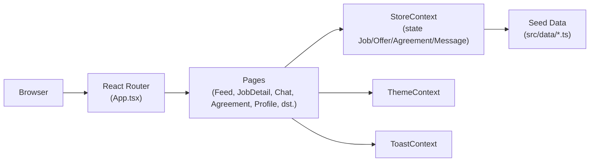
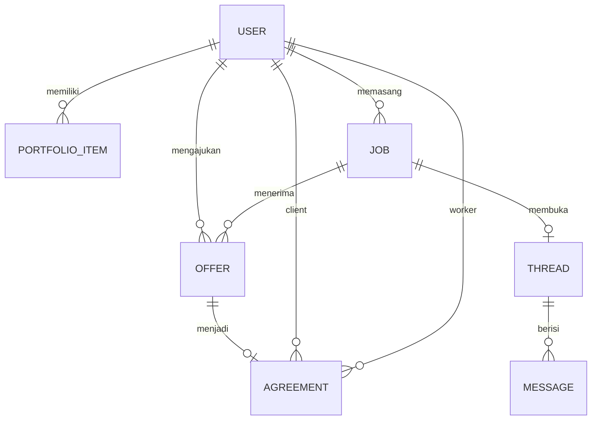

<div align="center">

  # Stepping Stone
  ### Kerja Kampus, Kesepakatan Jelas, Portofolio Nyata

  []()
  [](https://github.com/lewron135/Stepping-Stone)
  [](LICENSE)

  **Submission for ITECHNO CUP 2026 - Web Development**

  **By Entar ajadeh**

</div>

---

## 📋 Daftar Isi
- [Tentang Proyek](#-tentang-proyek)
- [Fitur Unggulan](#-fitur-unggulan)
- [Demo & Screenshot](#-demo--screenshot)
- [Teknologi](#-teknologi)
- [Arsitektur Sistem](#-arsitektur-sistem)
- [Instalasi & Setup](#-instalasi--setup)
- [Penggunaan](#-penggunaan)
- [API Documentation](#-api-documentation)
- [Testing](#-testing)
- [Tim Developer](#-tim-pengembang)
- [Lisensi](#-lisensi)

---

## 👥 Tim Developer

| Nama | Peran | GitHub |
|------|-------|--------|
| **Josep Natanael Pasaribu** | Ongoing | [@lewron135](https://github.com/lewron135) |
| **Marcellino Varian Saputra** | Ongoing | [@marcellinovs](https://github.com/marcellinovs) |
| **Stanley Lin** | Ongoing | [@Linneisa](https://github.com/Linneisa) |

---

## 🎯 Tentang Proyek

### Latar Belakang
Mahasiswa sering butuh uang cepat atau pengalaman kerja, tapi platform freelance yang ada terlalu besar dan kompetitif untuk kebutuhan sekecil "titip beli" atau "desain poster acara kampus". Di sisi lain, kerjaan informal antar teman kampus rawan masalah klasik: harga berubah di tengah jalan, tenggat molor tanpa kejelasan, sampai hasil kerja yang sudah selesai tidak dibayar — dan semuanya tidak meninggalkan bukti apa pun untuk portofolio.

### Solusi yang Ditawarkan
**Stepping Stone** adalah forum kerja antar mahasiswa dengan alur yang jelas dari awal sampai akhir: temukan pekerjaan → ajukan penawaran & nego lewat chat → kunci kesepakatan (harga & tenggat tidak bisa berubah lagi) → kerjakan & unggah bukti → dapat testimoni yang otomatis masuk ke portofolio. Setiap transaksi menghasilkan dua hal sekaligus: uang dan bukti pengalaman yang bisa ditunjukkan.

### Tujuan Proyek
- 🎯 **Tujuan Utama**: Mempertemukan mahasiswa yang butuh pekerjaan cepat/proyek dengan mahasiswa lain yang punya skill terkait, lewat kesepakatan yang jelas dan terlindungi bagi kedua pihak.
- 📊 **Target Pengguna**: Mahasiswa dalam lingkup kampus yang sama — baik sebagai pemberi kerja (klien) yang memasang pekerjaan, maupun pekerja yang mengajukan penawaran.
- 💡 **Value Proposition**: Kesepakatan yang terkunci (harga & tenggat tidak bisa diubah sepihak setelah disetujui), bukti kerja & testimoni yang otomatis membangun portofolio, serta **Career Compass** yang menyarankan proyek sedikit di atas level skill pengguna saat ini supaya portofolio naik bertahap.

---

## ✨ Fitur Unggulan

### Fitur Utama

| Fitur | Deskripsi | Keunggulan |
|----------|--------------|---------------|
| **Feed Kerja Cepat & Proyek** | Dua jenis pekerjaan: Kerja Cepat (mis. Antar & Ambil, Titip Beli, Pindah Barang, Bantu Acara) dan Proyek (mis. Desain Grafis, Coding & Web, Copywriting, Data & Riset) | Menyesuaikan skala kebutuhan, dari tugas singkat sampai proyek berbayar besar |
| **Ajukan & Nego lewat Chat** | Pekerja mengajukan penawaran harga + catatan, lalu lanjut nego langsung lewat chat dengan pemberi kerja | Transparan — kedua pihak bisa diskusi sebelum berkomitmen |
| **Kesepakatan Terkunci** | Setelah pekerja & klien sama-sama setuju, harga dan tenggat dikunci dan tidak bisa diubah sepihak | Melindungi kedua pihak dari perubahan harga/tenggat di tengah jalan |
| **Bukti Kerja & Testimoni ke Portofolio** | Pekerja mengunggah bukti hasil kerja, klien mengonfirmasi selesai sambil memberi rating & testimoni | Hasil kerja otomatis jadi entri portofolio yang bisa ditunjukkan ke pemberi kerja berikutnya |

### Fitur Tambahan
- **Career Compass** - Merekomendasikan pekerjaan yang "sedikit di atas" level skill pengguna berdasarkan riwayat kerja, supaya kemampuan naik bertahap.
- **Track Record & Profil Publik** - Statistik pekerjaan selesai/dibatalkan/laporan belum dibayar, plus galeri portofolio yang bisa dilihat publik di `/u/:handle`.
- **Laporan Belum Dibayar** - Mekanisme pelaporan saat klien tidak melakukan pembayaran setelah kesepakatan selesai, sebagai perlindungan bagi pekerja.
- **Mode Terang & Gelap** - Dua tema yang didesain setara, bisa diganti kapan saja lewat toggle di navbar.

---

## 📸 Demo & Screenshot

### Live Demo
🔗 **Ongoing** _(belum ada link demo yang di-deploy — akan diperbarui setelah rilis)_

### Screenshot Aplikasi
_Ongoing — screenshot akan ditambahkan setelah alur utama aplikasi selesai difinalisasi._

### Video Demo
📹 **Ongoing** _(opsional)_

---

## 🛠️ Teknologi

### Tech Stack

#### Frontend
```
Framework    : React 18 + Vite + TypeScript
UI Styling   : Tailwind CSS (custom theme via CSS variables, dark mode berbasis class)
Animation    : Framer Motion
Icons        : lucide-react
Routing      : React Router DOM v6
State Mgmt   : React Context API (StoreContext, ThemeContext, ToastContext)
```

#### Backend
```
Status       : Ongoing — belum ada backend/API terpisah
Data saat ini: Seed/mock data di src/data/ (users, jobs, offers, agreements, messages),
               dikelola sepenuhnya di sisi client lewat StoreContext (belum persisten,
               reset saat halaman di-refresh)
```

#### DevOps & Tools
```
Deployment   : Ongoing
CI/CD        : Ongoing
Linting      : ESLint (.eslintrc.cjs)
Testing      : Ongoing — belum ada test suite
```

### Alasan Pemilihan Teknologi

| Teknologi | Alasan Pemilihan |
|-----------|------------------|
| **Vite + React + TypeScript** | Dev experience cepat (HMR instan) dengan type-safety untuk model data yang cukup kompleks (Job, Offer, Agreement, dll). |
| **Tailwind CSS** | Utility-first sehingga cepat membangun UI konsisten, dipadukan dengan CSS variable custom agar tema terang/gelap gampang dikelola dari satu sumber warna. |
| **Framer Motion** | Transisi & micro-interaction halus (mis. tab switch, modal) yang mendukung kesan produk yang matang, bukan sekadar prototipe. |
| **React Context API** (bukan Redux) | Skala state aplikasi saat ini masih cukup sederhana untuk dikelola tanpa state management eksternal. |

### Dependencies Utama
```json
{
  "dependencies": {
    "react": "^18.3.1",
    "react-dom": "^18.3.1",
    "react-router-dom": "^6.26.2",
    "framer-motion": "^11.5.4",
    "lucide-react": "0.522.0",
    "@emotion/react": "^11.13.3"
  },
  "devDependencies": {
    "vite": "^5.2.0",
    "typescript": "^5.5.4",
    "tailwindcss": "3.4.17",
    "eslint": "^8.50.0"
  }
}
```

---

## 🏗️ Arsitektur Sistem

### System Architecture
Stepping Stone saat ini adalah **Single Page Application client-side murni** — belum ada backend/database sungguhan. Seluruh data disimpan sebagai seed data dan dikelola di memori browser lewat React Context.



> Ongoing: backend/API dan database persisten direncanakan pada tahap pengembangan berikutnya.

### Database Schema
Belum ada database sungguhan (Ongoing). Berikut model data yang sudah didefinisikan di `src/types/index.ts` sebagai acuan skema ke depannya:



### Folder Structure
```
Stepping-Stone/
├── src/
│   ├── components/
│   │   ├── agreement/     # Kartu & modal alur kesepakatan (ajukan → kunci → selesai)
│   │   ├── feed/          # Kartu pekerjaan, filter feed, skeleton loading
│   │   ├── layout/        # AppShell, Navbar, Sidebar
│   │   ├── offer/         # Kartu & modal penawaran harga
│   │   ├── profile/       # Kartu portofolio & statistik track record
│   │   └── ui/            # Design system primitives (Button, Modal, Input, dst.)
│   ├── contexts/          # StoreContext, ThemeContext, ToastContext
│   ├── data/              # Seed/mock data (users, jobs, interactions, reference)
│   ├── pages/             # Semua halaman (Landing, Feed, Chat, Profile, dst.)
│   ├── types/             # Definisi TypeScript
│   ├── utils/             # Helper (format, status, cn, compass)
│   ├── App.tsx            # Routing utama
│   └── index.tsx          # Entry point
├── public/                # Aset gambar statis
├── index.html
├── vite.config.ts
├── tailwind.config.js
└── package.json
```

---

## ⚙️ Instalasi & Setup

### Prerequisites
Pastikan Anda telah menginstall:
- **Node.js** (v18.x atau lebih tinggi)
- **npm**
- **Git**

### Langkah Instalasi

#### 1️⃣ Clone Repository
```bash
git clone https://github.com/lewron135/Stepping-Stone.git
cd Stepping-Stone
```

#### 2️⃣ Install Dependencies
```bash
npm install
```

#### 3️⃣ Environment Variables
Saat ini **belum ada environment variable** yang dibutuhkan — seluruh data masih berupa seed/mock data di sisi client (lihat `src/data/`). Bagian ini akan diperbarui begitu backend & konfigurasi API tersedia (Ongoing).

#### 4️⃣ Run Development Server
```bash
npm run dev
```
Aplikasi akan berjalan di `http://localhost:5173`

---

## 🚀 Penggunaan

### Menjalankan Aplikasi
```bash
# Development mode
npm run dev

# Production build
npm run build

# Preview hasil build
npm run preview

# Linting
npm run lint
```

### User Guide

1. **Masuk ke Aplikasi**: Buka halaman Landing lalu klik **Get Started** atau **Masuk**. _(Ongoing — belum ada sistem autentikasi sungguhan; saat ini aplikasi memakai satu akun demo tetap untuk keperluan prototipe.)_
2. **Jelajahi Pekerjaan**: Dari Feed, pilih tab **Kerja Cepat** atau **Proyek**, lalu buka detail pekerjaan yang diminati.
3. **Ajukan Penawaran**: Isi harga & catatan pada pekerjaan yang dipilih, lalu lanjutkan nego lewat halaman Chat.
4. **Kunci Kesepakatan**: Setelah klien memilih penawaran dan kedua pihak setuju, harga & tenggat otomatis terkunci di halaman Kesepakatan.
5. **Kerjakan & Buktikan**: Pekerja mengunggah bukti hasil kerja; klien mengonfirmasi selesai sambil memberi rating & testimoni yang masuk ke Portofolio pekerja.
6. **Pasang Pekerjaan Sendiri**: Buat lowongan baru lewat halaman **Pasang Pekerjaan** jika ingin berperan sebagai klien.

---

## 📚 API Documentation
Ongoing — belum ada backend/API terpisah. Seluruh interaksi data (membuat pekerjaan, mengajukan penawaran, mengunci kesepakatan, mengirim pesan, dst.) saat ini ditangani langsung di sisi client melalui `StoreContext` (`src/contexts/StoreContext.tsx`) menggunakan seed data. Dokumentasi API akan ditambahkan begitu backend sungguhan dibangun.

---

## 🧪 Testing
Ongoing — belum ada test suite (unit/integration/e2e) yang disiapkan untuk proyek ini.

---

## 📄 Lisensi
Proyek ini dilisensikan di bawah [MIT License](LICENSE) - lihat file LICENSE untuk detail lebih lanjut.

---

<div align="center">

  **Made with ❤️ by Entar ajadeh for ITECHNO CUP 2026**

</div>
